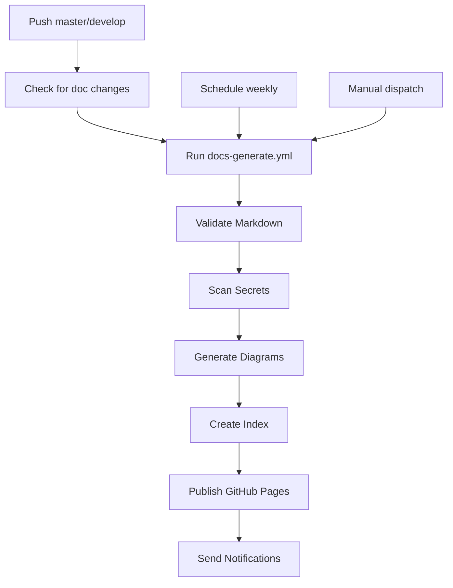

# 🎯 Auto-Documentation CI/CD - Guide Complet

Résumé de la configuration de génération automatique de documentation pour FreijStack.

**Dernière mise à jour**: Janvier 2026  
**Status**: ✅ Implémenté et testé  
**Commit**: `ae735e4`

---

## 📋 Résumé Implémentation

### Fichiers Créés

| Fichier | Type | Description |
|---------|------|-------------|
| [.github/workflows/docs-generate.yml](.github/workflows/docs-generate.yml) | Workflow | CI/CD auto-génération docs |
| [.github/docs-config.yml](.github/docs-config.yml) | Config | Configuration patterns + schedules |
| [.gitleaksignore](.gitleaksignore) | Config | Ignore faux positifs Gitleaks |
| [docs/cicd.mmd](docs/cicd.mmd) | Diagram | Diagram Mermaid du pipeline CI/CD |
| [docs/SECURITY_AUDIT.md](docs/SECURITY_AUDIT.md) | Guide | Classification docs + audit process |
| [docs/REDACTION_GUIDE.md](docs/REDACTION_GUIDE.md) | Guide | Patterns redaction secrets (before/after) |
| [scripts/docs-generate.sh](scripts/docs-generate.sh) | Script | Utilitaire Bash génération docs |
| [scripts/docs-generate.ps1](scripts/docs-generate.ps1) | Script | Utilitaire PowerShell génération docs |

### Fichiers Modifiés

| Fichier | Changes |
|---------|---------|
| [docs/CI_CD_ARCHITECTURE.md](docs/CI_CD_ARCHITECTURE.md) | + Référence `cicd.mmd` + liens sécurité |
| [scripts/README.md](scripts/README.md) | + Documentation docs-generate scripts |

---

## 🚀 Démarrage Rapide

### Workflow CI/CD Automatique

Le workflow `docs-generate.yml` s'exécute:

```
📅 Triggers:
├── Push sur master / develop (automatique)
├── Schedule: Chaque dimanche 00:00 UTC
└── Manual: workflow_dispatch
```

### Utilisation Locale

**Bash/Linux/Mac**:
```bash
./scripts/docs-generate.sh all         # Génération complète
./scripts/docs-generate.sh validate    # Validation seulement
./scripts/docs-generate.sh scan        # Scan secrets
./scripts/docs-generate.sh diagrams    # Générer Mermaid PNG/SVG
```

**PowerShell/Windows**:
```powershell
.\scripts\docs-generate.ps1 -Command all
.\scripts\docs-generate.ps1 -Command validate
.\scripts\docs-generate.ps1 -Command scan
```

---

## 🔐 Sécurité - Patterns Détectés

Le système scan automatiquement et bloque les patterns:

| Pattern | Type | Exemple |
|---------|------|---------|
| `AKIA*` | AWS Access Key | `<AWS_ACCESS_KEY_ID>` |
| `ASIA*` | AWS STS | `ASIATEMP...` |
| `ghp_*` | GitHub Token | `<GITHUB_TOKEN>` |
| `ghr_*` | GitHub Refresh | `ghr_abcd...` |
| `xox[baprs]-` | Slack Token | `<SLACK_TOKEN>` |
| `discord.com/api/webhooks` | Discord Webhook | Webhook URL |
| `sk_(live\|test)_` | Stripe API | `sk_live_...` |
| `postgresql://` | DB String | <DB_CONNECTION_STRING> |
| `-----BEGIN.*PRIVATE KEY` | Private Keys | SSH, RSA, EC keys |

**Action si détecté**:
- ❌ Push bloqué par GitHub
- ✅ Suggestion de redaction
- 📧 Notification team

---

## 📚 Outputs Générés

### Dans `docs/.generated/`

```
docs/.generated/
├── cicd.png          # Diagram PNG
├── cicd.svg          # Diagram SVG
└── [autres diagrams]
```

### Dans `/artifacts`

```
Artifacts uploadés (30 jours retention):
├── documentation         (fichier .zip et .tar.gz)
├── security-docs-report  (rapport sécurité)
└── (numérotés par run)
```

### Index & Résumé

- **docs/.index.json** - Index JSON de tous les docs
- **docs/.summary.txt** - Statistiques: doc count, line count, diagrams

### GitHub Pages

Master branch uniquement:
```
https://christophe-freijanes.github.io/freijstack/

Published:
├── docs/           # Tous les fichiers MD
├── .generated/     # Diagrams PNG/SVG
└── index.html      # Landing page (à créer)
```

---

## 📖 Documentation Créée

### 1. SECURITY_AUDIT.md
**Contenu**: Guide d'audit documentation

- ✅ Principes sécurité ("Secure by Default")
- ✅ Matrice classification (PUBLIC/INTERNAL/CONFIDENTIAL/SECRET)
- ✅ Structure recommandée `/docs` vs `/docs-private`
- ✅ Patterns sensibles à redacter (AWS, GitHub, DB, APIs)
- ✅ Scan automatisé (ripgrep)
- ✅ CI/CD workflow pour audit
- ✅ Checklist pre-commit
- ✅ Review process + approbations
- ✅ Gestion des accès par rôle
- ✅ FAQ & troubleshooting

**Sections clés**:
- 📋 Checklist pre-commit
- 🔍 Patterns regex pour scan
- 🤖 GitHub Actions workflow
- 📊 Matrice approbation
- 🔐 Access control par rôle

### 2. REDACTION_GUIDE.md
**Contenu**: Reference rapide patterns redaction

- AWS (AKIA, ASIA)
- Azure (keys, subscriptions)
- GCP (credentials, projects)
- GitHub (tokens, keys)
- JWT secrets
- Database passwords
- Webhooks (Slack, Discord)
- URLs sensibles
- IPs privées
- SSH keys
- Données personnelles
- Configurations (.env)
- **Exemples complets**: Avant/Après

**Format**: Copy-paste friendly

---

## 🛠️ Configuration

### .github/docs-config.yml

```yaml
documentation:
  generate:
    diagrams: true
    index: true
    validate_links: true
    scan_secrets: true
  
  schedules:
    daily: '0 2 * * *'       # 2h du matin
    weekly: '0 0 * * 0'      # Chaque dimanche
    monthly: '0 0 1 * *'     # 1er du mois
  
  security:
    patterns: [AWS, GitHub, Slack, DB, etc]
    on_secret_found: BLOCK
```

### .gitleaksignore

Ignore les faux positifs:
```
docs/REDACTION_GUIDE.md:146      # Exemples de patterns
docs/SECURITY_AUDIT.md:131       # Exemples API keys
.env.example                      # Template files
```

---

## ✨ Fonctionnalités

### Validation

✅ **Markdown Linting**
- Règles standard (headings, spacing, etc)
- Strict: warnings ne bloquent pas
- Customizable via .markdownlint.json

✅ **Scan Secrets**
- 9+ patterns détectés
- Regex sophistiquées
- Ignore faux positifs via .gitleaksignore

✅ **Validation Liens**
- Check liens internes
- Fail si broken link
- Ignore URLs externes

### Génération

✅ **Mermaid Diagrams**
- Conversion PNG/SVG
- Stockage dans `docs/.generated/`
- Caching pour performance

✅ **Index JSON**
- Liste tous les docs
- Titre + taille fichier
- Timestamp génération

✅ **Résumé Statistiques**
- Total documents
- Total lignes
- Diagrams générés
- Status sécurité

### Publication

✅ **GitHub Pages** (master only)
- Pub auto vers `gh-pages`
- CNAME: `docs.freijstack.com`
- 30 jours retention artifacts

✅ **Notifications**
- Success: Slack + GitHub comments
- Failure: Slack + Email + GitHub issue

---

## 🔄 Workflows

### Déclenchement Automatique



### Process Local

```bash
./scripts/docs-generate.sh all
  ├── check-dependencies     # Verify npm, node, tools
  ├── validate-markdown      # markdownlint-cli2
  ├── scan-secrets           # ripgrep + patterns
  ├── validate-links         # Check internal links
  ├── generate-diagrams      # mmdc (mermaid-cli)
  ├── generate-index         # JSON + stats
  ├── generate-summary       # Text report
  └── clean (optional)       # Cleanup .generated
```

---

## 📊 Métriques & Monitoring

### Artifacts Collectés

| Artifact | Frequency | Size | Retention |
|----------|-----------|------|-----------|
| documentation | Each run | ~1-5MB | 30 days |
| security-docs-report | Each run | ~10KB | 30 days |
| Diagrams PNG/SVG | Weekly | ~500KB | in-repo |

### Logs & Reporting

- ✅ GitHub Actions logs (7 days)
- ✅ Artifacts list (30 days)
- ✅ PR comments (auto-posted)
- ✅ Email notifications (failure)

---

## 🐛 Troubleshooting

### Diagrammes Mermaid non générés

```bash
# Tester localement
npm install -g @mermaid-js/mermaid-cli
mmdc -i docs/cicd.mmd -o /tmp/test.png
```

### Faux positifs secrets

Ajouter à `.gitleaksignore`:
```
docs/MYFILE.md:123
```

### Workflow slow

- Reduce frequency (pas quotidien)
- Skip diagram generation
- Use caching pour npm modules

---

## 🔗 Ressources

### Tools Utilisés
- [markdownlint-cli2](https://github.com/DavidAnson/markdownlint) - Markdown validation
- [@mermaid-js/mermaid-cli](https://github.com/mermaid-js/mermaid-cli) - Diagram generation
- [ripgrep (rg)](https://github.com/BurntSushi/ripgrep) - Fast file search
- [GitHub Secret Scanning](https://docs.github.com/en/code-security/secret-scanning) - Automatic detection

### Documentation
- [CI_CD_ARCHITECTURE.md](docs/CI_CD_ARCHITECTURE.md) - Details workflows
- [SECURITY_AUDIT.md](docs/SECURITY_AUDIT.md) - Security guidelines
- [REDACTION_GUIDE.md](docs/REDACTION_GUIDE.md) - Redaction patterns
- [docs-config.yml](.github/docs-config.yml) - Configuration details

### GitHub Actions
- [docs-generate.yml](.github/workflows/docs-generate.yml) - Main workflow
- [.github/workflows/](../.github/workflows/) - All workflows

---

## 📝 Checklist Intégration

Avant de merger vers develop:

- [ ] Tous les secrets redactés dans `/docs`
- [ ] `.gitleaksignore` mis à jour si faux positifs
- [ ] Diagrams Mermaid validés (`mmdc` test)
- [ ] Liens internes vérifiés (pas broken links)
- [ ] Scripts bash/ps1 exécutables et testés
- [ ] CI/CD workflow triggers correctement
- [ ] GitHub Pages configuration OK
- [ ] Discord/Slack webhooks configurés (optionnel)

---

## 🚀 Prochaines Étapes

1. **Merge release-test → develop** 
   - Vérifier PR checks pass
   
2. **Merge develop → master**
   - Déclenche GitHub Pages publication
   
3. **Monitor first runs**
   - Check artifacts
   - Check GitHub Pages
   
4. **Configure notifications** (optionnel)
   - Discord webhook
   - Email alerts

---

## Support

Questions ou problèmes?

- 📧 Email: team@freijstack.com
- 🐛 Issues: [GitHub Issues](https://github.com/christophe-freijanes/freijstack/issues)
- 💬 Slack: #documentation channel

---

**Mainteneur**: DevOps Team  
**Licence**: All Rights Reserved  
**Version**: 1.0.0  
**Dernière mise à jour**: Janvier 2026
