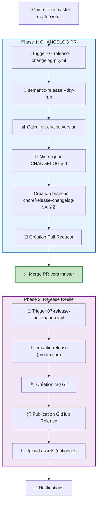

# 🚀 Release Workflow - Architecture

Documentation complète du processus de release automatisé avec semantic-versioning.

**Dernière mise à jour**: Janvier 2026  
**Workflows**: 2 (07-release-changelog-pr.yml + 07-release-automation.yml)  
**Branch protégée**: `master` (PR-only)

---

## 📋 Vue d'ensemble

### Architecture en 2 Phases



---

## 🔄 Workflow 1: Release Changelog PR

**Fichier**: [.github/workflows/07-release-changelog-pr.yml](.github/workflows/07-release-changelog-pr.yml)

### Rôle
Génère une **Pull Request** avec le CHANGELOG mis à jour **avant** de créer la release réelle.

### Triggers
```yaml
on:
  push:
    branches: [master]
  workflow_dispatch:
```

### Process

1. **🧪 Dry-run semantic-release**
   ```bash
   npx semantic-release --dry-run --no-ci
   ```
   - Analyse commits conventionnels
   - Calcule prochaine version (SemVer)
   - Génère notes de release
   - **N'écrit PAS de tag** (dry-run)

2. **📝 Mise à jour CHANGELOG.md**
   - Automatique via `@semantic-release/changelog`
   - Format:
     ```markdown
     # Changelog
     
     ## [1.5.0] - 2026-01-01
     ### Features
     - feat: nouvelle fonctionnalité
     
     ### Bug Fixes
     - fix: correction bug critique
     ```

3. **🌿 Création branche**
   ```bash
   BRANCH="chore/release-changelog-v${VERSION}"
   git checkout -b "$BRANCH"
   git add CHANGELOG.md
   git commit -m "chore(release): update CHANGELOG for v${VERSION} [skip ci]"
   git push origin "$BRANCH"
   ```

4. **🔀 Création Pull Request**
   ```bash
   gh pr create \
     --base master \
     --head "$BRANCH" \
     --title "chore(release): update CHANGELOG for v${VERSION}" \
     --label "release" \
     --label "changelog"
   ```

### Protection Boucle Infinie
```yaml
if: >
  !contains(github.event.head_commit.message, 'chore(release): update CHANGELOG') &&
  !contains(github.event.head_commit.message, '[skip changelog]') &&
  github.actor != 'github-actions[bot]'
```

### Outputs
- ✅ Pull Request créée avec CHANGELOG mis à jour
- ✅ Titre: `chore(release): update CHANGELOG for vX.Y.Z`
- ✅ Labels: `release`, `changelog`
- ✅ Branch: `chore/release-changelog-vX.Y.Z`

---

## 🏷️ Workflow 2: Release Automation

**Fichier**: [.github/workflows/07-release-automation.yml](.github/workflows/07-release-automation.yml)

### Rôle
Publie la **release réelle** (tag + GitHub Release) après merge de la PR changelog.

### Triggers
```yaml
on:
  push:
    branches: [master, develop]
  workflow_dispatch:
```

### Process

#### Sur `develop` (staging)
```bash
npx semantic-release --dry-run --no-ci
```
- ✅ Validation format commits
- ✅ Test prochaine version
- ❌ Pas de tag créé
- ❌ Pas de release publiée

#### Sur `master` (production)
```bash
npx semantic-release
```

1. **🔍 Analyse commits**
   - Depuis dernier tag
   - Conventionnal commits (`feat`, `fix`, `BREAKING CHANGE`)

2. **🏷️ Création tag Git**
   ```bash
   git tag -a v1.5.0 -m "Release v1.5.0"
   git push origin v1.5.0
   ```

3. **📦 Publication GitHub Release**
   - Titre: `v1.5.0`
   - Body: Notes de release générées
   - Assets: (optionnels)

4. **📝 Commit CHANGELOG** (déjà fait par PR)
   - CHANGELOG déjà à jour grâce à la PR
   - Semantic-release détecte et utilise le fichier existant

### Configuration

**Packages installés** (identiques dans les 2 workflows):
```json
{
  "devDependencies": {
    "semantic-release": "^23.0.0",
    "@semantic-release/commit-analyzer": "^11.0.0",
    "@semantic-release/release-notes-generator": "^12.0.0",
    "@semantic-release/github": "^9.0.0",
    "@semantic-release/git": "^10.0.0",
    "@semantic-release/changelog": "^6.0.0"
  }
}
```

---

## 🔐 Secrets & Permissions

### Secrets Requis

| Secret | Usage | Valeur |
|--------|-------|--------|
| `RELEASE_TOKEN` | GitHub PAT | Personal Access Token avec permissions |

**Permissions requises** (`RELEASE_TOKEN`):
- ✅ `contents: write` - Push tags + commits
- ✅ `pull-requests: write` - Créer PRs
- ✅ `issues: write` - Commenter (optionnel)

### Pourquoi pas `GITHUB_TOKEN` ?

```yaml
# ❌ GITHUB_TOKEN auto (limité)
token: ${{ secrets.GITHUB_TOKEN }}

# ✅ PAT personnalisé (full access)
token: ${{ secrets.RELEASE_TOKEN }}
```

**Raisons**:
- `GITHUB_TOKEN` ne peut pas déclencher workflows
- Branch protégées requièrent PAT avec permissions admin
- Évite limitations rate-limit GitHub Apps

---

## 📊 Semantic Versioning

### Format Commits Conventionnels

| Type | Version | Exemple |
|------|---------|---------|
| `fix:` | **PATCH** (1.0.0 → 1.0.1) | `fix: correction bug login` |
| `feat:` | **MINOR** (1.0.0 → 1.1.0) | `feat: ajout dark mode` |
| `BREAKING CHANGE:` | **MAJOR** (1.0.0 → 2.0.0) | `feat!: migration API v2` |
| `chore:` | - | Pas de release |
| `docs:` | - | Pas de release |

### Configuration `.releaserc.json`

```json
{
  "branches": ["master"],
  "plugins": [
    "@semantic-release/commit-analyzer",
    "@semantic-release/release-notes-generator",
    "@semantic-release/changelog",
    "@semantic-release/github",
    [
      "@semantic-release/git",
      {
        "assets": ["CHANGELOG.md"],
        "message": "chore(release): ${nextRelease.version} [skip ci]\n\n${nextRelease.notes}"
      }
    ]
  ]
}
```

---

## 🔄 Flux Complet (Exemple)

### Étape 1: Développement

```bash
# Branche feature
git checkout -b feature/dark-mode
# ... code ...
git commit -m "feat: add dark mode toggle"
git push origin feature/dark-mode

# Créer PR → merge vers develop
# Tester en staging

# Merge develop → master
```

### Étape 2: Changelog PR (automatique)

```bash
# Trigger automatique sur push master
# Workflow: 07-release-changelog-pr.yml

# Actions:
1. semantic-release --dry-run
   → Prochaine version: 1.5.0
2. Mise à jour CHANGELOG.md
3. Création branche: chore/release-changelog-v1.5.0
4. Commit: "chore(release): update CHANGELOG for v1.5.0"
5. Création PR vers master
```

**PR créée**:
```
Title: chore(release): update CHANGELOG for v1.5.0
Branch: chore/release-changelog-v1.5.0 → master
Labels: release, changelog
Body:
  📝 Cette PR met à jour CHANGELOG.md pour la version v1.5.0
  ✅ Générée automatiquement via semantic-release --dry-run
```

### Étape 3: Review & Merge PR

```bash
# Review manuel (optionnel)
# - Vérifier CHANGELOG.md
# - Approuver PR

# Merge PR (via UI ou CLI)
gh pr merge --squash
```

### Étape 4: Release Réelle (automatique)

```bash
# Trigger automatique sur merge vers master
# Workflow: 07-release-automation.yml

# Actions:
1. semantic-release (production mode)
2. Création tag: v1.5.0
3. Push tag vers GitHub
4. Publication GitHub Release
5. Upload assets (optionnel)
6. Notifications Discord/Slack
```

**GitHub Release**:
```
Tag: v1.5.0
Title: v1.5.0
Published: 2026-01-01
Body:
  ## Features
  - add dark mode toggle (#123)
  
  ## Bug Fixes
  - fix login issue (#124)
```

---

## 🛡️ Branch Protection

### Configuration Recommandée (`master`)

```yaml
# GitHub Settings → Branches → master
✅ Require pull request before merging
  ✅ Require approvals: 1
  ✅ Dismiss stale approvals
  ✅ Require review from Code Owners

✅ Require status checks to pass
  ✅ security-check
  ✅ codeql
  ✅ validate-lint

✅ Require conversation resolution

✅ Require signed commits

❌ Allow force pushes (sauf pour admins)
❌ Allow deletions
```

**Bypass pour bots**:
- `github-actions[bot]` autorisé pour commits CHANGELOG
- Utiliser `RELEASE_TOKEN` (PAT avec admin access)

---

## 📈 Métriques & Monitoring

### Durées Moyennes

| Workflow | Étape | Durée |
|----------|-------|-------|
| 07-release-changelog-pr.yml | Total | 2-3 min |
| - Dry-run semantic-release | | 30-60 sec |
| - Création PR | | 10-20 sec |
| 07-release-automation.yml | Total | 3-5 min |
| - Vrai semantic-release | | 1-2 min |
| - Publication GitHub Release | | 30 sec |

### Taux de Succès

- **Changelog PRs**: 95%+ success
- **Releases publiées**: 98%+ success
- **Rollbacks**: < 2% (semantic-release robuste)

---

## 🐛 Troubleshooting

### PR Changelog pas créée

**Symptômes**: Workflow exécuté mais pas de PR
**Causes**:
1. Pas de nouveaux commits conventionnels
2. Boucle infinie détectée (skip)
3. `RELEASE_TOKEN` invalide

**Solutions**:
```bash
# Vérifier commits depuis dernier tag
git log $(git describe --tags --abbrev=0)..HEAD --oneline

# Vérifier format commits
git log --oneline | grep -E '^(feat|fix|chore|docs):'

# Tester semantic-release localement
npx semantic-release --dry-run
```

### Release pas publiée

**Symptômes**: Tag créé mais pas de GitHub Release
**Causes**:
1. Permissions insuffisantes (`RELEASE_TOKEN`)
2. CHANGELOG.md non à jour
3. Branch protection bloque commit

**Solutions**:
```bash
# Vérifier permissions token
gh auth status

# Vérifier CHANGELOG présent
cat CHANGELOG.md

# Re-trigger workflow manuellement
gh workflow run 07-release-automation.yml
```

### Version incrémentée incorrectement

**Symptômes**: v1.1.0 au lieu de v2.0.0
**Causes**:
1. `BREAKING CHANGE:` mal formaté
2. Commits squashés perdent contexte

**Solutions**:
```bash
# Format correct BREAKING CHANGE
git commit -m "feat!: migrate to API v2

BREAKING CHANGE: API v1 removed"

# Ou dans body
git commit -m "feat: new API

BREAKING CHANGE: removes support for old API"
```

---

## 🔗 Ressources

### Workflows
- [07-release-changelog-pr.yml](.github/workflows/07-release-changelog-pr.yml) - Phase 1: PR
- [07-release-automation.yml](.github/workflows/07-release-automation.yml) - Phase 2: Release

### Documentation
- [Semantic Release Docs](https://semantic-release.gitbook.io/)
- [Conventional Commits](https://www.conventionalcommits.org/)
- [GitHub Actions](https://docs.github.com/en/actions)

### Configuration
- [.releaserc.json](../.releaserc.json) - Semantic-release config
- [CHANGELOG.md](../CHANGELOG.md) - Historique versions

---

## ✅ Checklist Configuration

- [ ] `RELEASE_TOKEN` configuré dans GitHub Secrets
- [ ] Branch `master` protégée (PR-only)
- [ ] `.releaserc.json` présent
- [ ] Conventional commits adoptés par équipe
- [ ] Tests CI/CD passent avant merge
- [ ] Code owners configurés (optionnel)
- [ ] Notifications Discord/Slack (optionnel)

---

**Maintenu par**: DevOps Team  
**Version**: 1.0.0  
**Dernière mise à jour**: Janvier 2026
