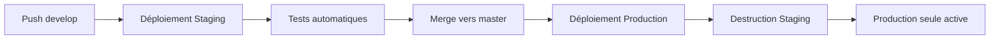

# 🤖 Automatisation Complète SecureVault

---

## 📝 Résumé

Ce guide explique comment automatiser entièrement le déploiement et la gestion des environnements SecureVault (staging et production) : zéro intervention manuelle, sécurité renforcée, et cycle de vie intelligent.

- **Public visé** : DevOps, administrateurs, contributeurs
- **Objectif** : Comprendre et utiliser l’automatisation CI/CD pour SecureVault
- **Points clés** : Staging éphémère, production 24/7, auto-destruction, auto-healing

---

## 📋 Table des matières

- [Vue d'ensemble](#vue-densemble)
- [Workflow Automatique](#workflow-automatique)
- [Environnements](#environnements)
- [Destruction Automatique du Staging](#destruction-automatique-du-staging)
- [Protection de la Production](#protection-de-la-production)
- [Déploiements](#déploiements)
- [Résolution de Problèmes](#résolution-de-problèmes)

---

## 📋 Table des matières

- [Vue d'ensemble](#vue-densemble)
- [Workflow Automatique](#workflow-automatique)
- [Environnements](#environnements)
- [Destruction Automatique du Staging](#destruction-automatique-du-staging)
- [Protection de la Production](#protection-de-la-production)
- [Déploiements](#déploiements)
- [Résolution de Problèmes](#résolution-de-problèmes)

## 🎯 Vue d'ensemble

### Principe de fonctionnement



### Règles de base

1. **Production** (`master`) : Toujours en ligne, jamais détruite
2. **Staging** (`develop`) : Éphémère, détruite automatiquement après merge vers master
3. **Aucune intervention manuelle** : Tout est automatisé

### Fonctionnement simplifié

- **Push sur `develop`** → Déploiement automatique en staging
- **Merge vers `master`** → Déploiement automatique en production
- **Destruction automatique du staging** après merge
- **Production** : toujours en ligne, jamais détruite
- **Aucune intervention manuelle** : tout est automatisé


## 🔄 Workflow Automatique

### Développement sur `develop`

```bash
# 1. Créer une branche feature
git checkout develop
git pull
git checkout -b feature/ma-fonctionnalite

# 2. Coder et commiter
git add .
git commit -m "feat: nouvelle fonctionnalité"

# 3. Push
git push origin feature/ma-fonctionnalite
```

**Ce qui se passe automatiquement :**

### Étapes principales

1. **Développement sur une branche feature**
   - `git checkout develop && git checkout -b feature/ma-fonctionnalite`
   - `git add . && git commit -m "feat: ..." && git push origin feature/ma-fonctionnalite`
2. **Merge vers `develop`**
   - Déclenche le déploiement automatique en staging
3. **Tests sur staging**
   - Accès : [vault-staging.freijstack.com](https://vault-staging.freijstack.com)
4. **Merge vers `master`**
   - Déclenche le déploiement en production
   - Staging détruit automatiquement
   - Accès : [vault.freijstack.com](https://vault.freijstack.com)

**Automatisations incluses** :
- Validation du code
- Tests de sécurité
- Déploiement automatique
- Destruction automatique du staging

### Merge vers `develop` (Staging)

```bash
# 1. Pull request feature -> develop
# 2. Review et merge sur GitHub
# 3. Ou merge local
git checkout develop
git merge feature/ma-fonctionnalite
git push origin develop
```

**Ce qui se passe automatiquement :**
1. ✅ Validation complète
2. ✅ Tests unitaires et d'intégration
3. ✅ Build Docker
4. ✅ Déploiement automatique sur **STAGING**
   - Frontend: https://vault-staging.freijstack.com
   - Backend: https://vault-api-staging.freijstack.com
5. ✅ Migrations de base de données
6. ✅ Vérification post-déploiement
7. ✅ Tests de santé (health checks)

### Merge vers `master` (Production)

```bash
# 1. Pull request develop -> master
# 2. Review et merge sur GitHub
# 3. Ou merge local
git checkout master
git merge develop
git push origin master
```

**Ce qui se passe automatiquement :**
1. ✅ Validation complète
2. ✅ Tests unitaires et d'intégration
3. ✅ Build Docker
4. ✅ Déploiement automatique sur **PRODUCTION**
   - Frontend: https://vault.freijstack.com
   - Backend: https://vault-api.freijstack.com
5. ✅ Migrations de base de données
6. ✅ Vérification post-déploiement
7. ✅ Tests de santé (health checks)
8. 🔥 **DESTRUCTION AUTOMATIQUE DU STAGING**
   - Arrêt de tous les conteneurs staging
   - Suppression des conteneurs staging
   - Suppression du réseau staging
   - Conservation des volumes (sécurité des données)

## 🌍 Environnements

### Staging (Éphémère)

| Propriété | Valeur |
|-----------|--------|
| **Branche** | `develop` |
| **Durée de vie** | Temporaire (détruit après merge vers master) |
| **Objectif** | Tests et validation |
| **Frontend** | https://vault-staging.freijstack.com |
| **Backend** | https://vault-api-staging.freijstack.com |
| **Base de données** | securevault_staging |
| **Utilisateur PostgreSQL** | securevault_staging |
| **Répertoire VPS** | `/srv/www/securevault-staging` |
| **Conteneurs** | `securevault-staging-*` |

**Cycle de vie :**
```
Push develop → Création/MAJ staging → Tests → Merge master → Destruction staging
```

### Production (Permanente)

| Propriété | Valeur |
|-----------|--------|
| **Branche** | `master` |
| **Durée de vie** | Permanente (jamais détruite) |
| **Objectif** | Application en production |
| **Frontend** | https://vault.freijstack.com |
| **Backend** | https://vault-api.freijstack.com |
| **Base de données** | securevault |
| **Utilisateur PostgreSQL** | securevault |
| **Répertoire VPS** | `/srv/www/securevault` |
| **Conteneurs** | `securevault-*` |
| **Surveillance** | Health check toutes les 15 minutes |

**Protection :**
- ✅ Health check continu (toutes les 15 min)
- ✅ Auto-healing en cas de problème
- ✅ Jamais arrêtée automatiquement
- ✅ Monitoring actif 24/7

## 🔥 Destruction Automatique du Staging

### Déclenchement

La destruction du staging est **automatique** et se produit dans **2 cas uniquement** :

#### 1. Merge automatique (Recommandé)

```bash
git checkout master
git merge develop
git push origin master
```

✅ Le workflow détecte le merge vers master et détruit staging automatiquement.

#### 2. Déclenchement manuel (Pour tests)

Sur GitHub Actions :
1. Aller dans **Actions** → **SecureVault Deploy**
2. Cliquer sur **Run workflow**
3. Sélectionner :
   - Environment: `production` ou `staging`
   - **🔥 Détruire Staging : `true`**
4. Cliquer **Run workflow**

### Processus de destruction

```bash
# Staging: /srv/www/securevault-staging/saas/securevault
1. 🛑 Arrêt de tous les conteneurs staging
   docker compose down

2. 🗑️  Suppression des conteneurs
   - securevault-staging-backend
   - securevault-staging-frontend
   - securevault-staging-postgres

3. 🔌 Suppression du réseau
   - securevault_staging_network

4. 💾 VOLUMES PRÉSERVÉS (sécurité)
   - securevault-staging_postgres_data
   → Permet récupération des données si besoin

5. ✅ Confirmation
   - Vérification que tous les conteneurs sont supprimés
   - Vérification que le réseau est supprimé
```

### Sécurité des données

**Les volumes ne sont PAS détruits automatiquement** pour éviter la perte accidentelle de données.

**Pour supprimer les volumes manuellement (après vérification) :**

```bash
# Sur le VPS
ssh user@vps

# Lister les volumes staging
docker volume ls | grep staging

# Supprimer un volume spécifique
docker volume rm securevault-staging_postgres_data

# Ou supprimer tous les volumes staging
docker volume rm $(docker volume ls -q | grep staging)
```

### Recréation du staging

Le staging est automatiquement **recréé** au prochain push sur `develop` :

```bash
git checkout develop
git pull
# ... faire des modifications ...
git add .
git commit -m "feat: nouvelle feature"
git push origin develop
```

→ Le workflow détecte le push sur `develop` et **redéploie staging automatiquement**.

## 🛡️ Protection de la Production

### Health Check Automatique

Le workflow `production-healthcheck.yml` surveille production **toutes les 15 minutes** :

```yaml
# .github/workflows/production-healthcheck.yml
schedule:
  - cron: '*/15 * * * *'  # Toutes les 15 minutes
```

**Ce qui est vérifié :**

1. **Frontend** : https://vault.freijstack.com
   - Timeout : 10 secondes
   - Attendu : HTTP 200

2. **Backend API** : https://vault-api.freijstack.com/api/health
   - Timeout : 10 secondes
   - Attendu : HTTP 200 avec `{"status": "ok"}`

3. **Base de données** : PostgreSQL via SSH
   - Commande : `pg_isready -U securevault`
   - Attendu : "accepting connections"

### Auto-Healing

Si un health check **échoue**, le système se répare **automatiquement** :

```bash
# Sur le VPS, automatiquement via GitHub Actions
cd /srv/www/securevault/saas/securevault
docker compose restart

# Attente 30 secondes pour stabilisation
sleep 30

# Nouvelle vérification
curl http://localhost:3001/api/health
```

**Si l'auto-healing échoue :**
- ❌ Alerte critique dans GitHub Actions
- 📧 Notification (configurable : Slack, Discord, Email)
- 🚨 Intervention manuelle requise

### Déclenchement manuel

Pour forcer un health check et auto-healing :

1. GitHub : **Actions** → **Production Health Check**
2. Cliquer **Run workflow**
3. Sélectionner `auto_heal: true`
4. Cliquer **Run workflow**

## 🚀 Déploiements

### Déploiement Staging (develop)

```bash
# Méthode 1 : Push direct
git checkout develop
git add .
git commit -m "feat: nouvelle feature"
git push origin develop
→ Déploiement automatique sur staging

# Méthode 2 : Manuel via GitHub Actions
Actions → SecureVault Deploy → Run workflow
- Environment: staging
→ Déploiement manuel sur staging
```

### Déploiement Production (master)

```bash
# Méthode recommandée : Merge develop → master
git checkout master
git merge develop
git push origin master
→ Déploiement automatique sur production
→ Destruction automatique du staging

# Méthode alternative : Pull Request
1. Sur GitHub : develop → master (Pull Request)
2. Review du code
3. Merge Pull Request
→ Déploiement automatique
→ Destruction staging
```

### Rollback Production

Si un déploiement échoue en production :

```bash
# 1. Revenir à la version précédente
git revert HEAD
git push origin master

# 2. Ou revenir à un commit spécifique
git reset --hard <commit-sha>
git push -f origin master

→ Redéploiement automatique de la version précédente
```

## 🔧 Commandes Utiles

### Vérifier l'état des environnements

```bash
# SSH sur le VPS
ssh user@vps

# Staging
cd /srv/www/securevault-staging/saas/securevault
docker compose ps
docker compose logs -f backend

# Production
cd /srv/www/securevault/saas/securevault
docker compose ps
docker compose logs -f backend
```

### Vérifier les migrations

```bash
# Staging
cd /srv/www/securevault-staging
./scripts/run-migrations.sh staging

# Production
cd /srv/www/securevault
./scripts/run-migrations.sh production
```

### Vérifier les logs

```bash
# Staging - Backend
cd /srv/www/securevault-staging/saas/securevault
docker compose logs -f backend --tail=100

# Production - Backend
cd /srv/www/securevault/saas/securevault
docker compose logs -f backend --tail=100
```

### État des volumes

```bash
# Lister tous les volumes
docker volume ls

# Volumes staging
docker volume ls | grep staging

# Volumes production
docker volume ls | grep securevault | grep -v staging
```

## 🐛 Résolution de Problèmes

### Staging ne se détruit pas

**Symptômes :**
- Staging toujours actif après merge vers master
- Conteneurs staging toujours en cours d'exécution

**Solutions :**

```bash
# 1. Vérifier le workflow GitHub Actions
# Actions → SecureVault Deploy → Dernier run
# Vérifier que le job "Destroy Staging" s'est exécuté

# 2. Destruction manuelle
ssh user@vps
cd /srv/www/securevault-staging/saas/securevault
docker compose down
docker rm -f securevault-staging-backend securevault-staging-frontend securevault-staging-postgres
docker network rm securevault_staging_network

# 3. Déclenchement manuel via GitHub Actions
Actions → SecureVault Deploy → Run workflow
- Environment: production
- Détruire Staging: true
```

### Production ne répond plus

**Symptômes :**
- https://vault.freijstack.com retourne 502/503
- Backend API timeout

**Solutions :**

```bash
# 1. Vérifier le health check
# GitHub Actions → Production Health Check
# Si auto-heal a échoué, intervention manuelle :

ssh user@vps
cd /srv/www/securevault/saas/securevault

# Vérifier l'état des conteneurs
docker compose ps

# Redémarrer si nécessaire
docker compose restart

# Vérifier les logs
docker compose logs -f backend

# Vérifier la connexion database
docker compose exec postgres pg_isready -U securevault
```

### Migrations échouent

**Symptômes :**
- Déploiement réussi mais migrations échouent
- Erreur "relation already exists" ou "role does not exist"

**Solutions :**

```bash
# 1. Vérifier les credentials PostgreSQL
ssh user@vps
cd /srv/www/securevault/saas/securevault
cat .env | grep POSTGRES

# 2. Exécuter les migrations manuellement
cd /srv/www/securevault
./scripts/run-migrations.sh production

# 3. Si erreurs persistent, vérifier la connexion
docker compose exec postgres psql -U securevault -d securevault -c "\dt"
```

### Besoin de recréer staging

**Si staging a été détruit et vous voulez le recréer :**

```bash
# Simplement push sur develop
git checkout develop
git pull
git push origin develop

→ Le workflow détecte le push et redéploie staging automatiquement
```

## 📊 Monitoring

### GitHub Actions

Tous les workflows sont visibles dans :
- **GitHub** → **Actions**

**Workflows principaux :**

1. **SecureVault Deploy** : Déploiements staging/production
2. **Production Health Check** : Surveillance 24/7
3. **Backup** : Sauvegardes cloud quotidiennes

### Logs temps réel

```bash
# Staging
ssh user@vps
cd /srv/www/securevault-staging/saas/securevault
docker compose logs -f

# Production
cd /srv/www/securevault/saas/securevault
docker compose logs -f
```

### Métriques

Pour ajouter des métriques avancées (optionnel) :

```bash
# Installer Prometheus/Grafana
# Voir docs/MONITORING.md
```

## ✅ Checklist Automatisation

### Configuration initiale (une fois)

- [ ] Secrets GitHub configurés :
  - `VPS_SSH_KEY`
  - `VPS_SSH_HOST`
  - `VPS_SSH_USER`
- [ ] Workflows activés dans GitHub Actions
- [ ] Health check activé (toutes les 15 min)
- [ ] Variables d'environnement sur VPS (.env pour staging et production)

### Workflow quotidien (aucune intervention)

- [x] Push sur `develop` → Déploiement automatique staging
- [x] Merge vers `master` → Déploiement automatique production
- [x] Staging détruit après merge
- [x] Production surveillée 24/7
- [x] Auto-healing en cas de problème
- [x] Migrations automatiques
- [x] Sauvegardes cloud quotidiennes

## 🎯 Résumé

**Vous n'avez RIEN à faire manuellement :**

1. **Développement** : Coder sur `develop`
2. **Tests** : Push → Staging déployé automatiquement
3. **Production** : Merge `develop` → `master` → Production déployée, staging détruit
4. **Surveillance** : Health check toutes les 15 min avec auto-healing
5. **Sauvegardes** : Automatiques tous les jours à 3h du matin

**Production reste TOUJOURS en ligne**, staging est éphémère et se détruit automatiquement après chaque déploiement en production.

## 📚 Ressources

- [Architecture](./ARCHITECTURE.md)
- [Déploiement](./DEPLOYMENT.md)
- [Dépannage](./TROUBLESHOOTING.md)
- [Sauvegardes Cloud](./CLOUD_BACKUP.md)
- [Monitoring](./MONITORING.md)
