# 🔄 Architecture CI/CD - FreijStack

Documentation complète des pipelines CI/CD et workflows automatisés.

**Dernière mise à jour**: Janvier 2026  
**Technologies**: GitHub Actions, Docker, Traefik  
**Environnements**: Production (master), Staging (develop)

---

## 📋 Table des Matières

1. [Vue d'ensemble](#vue-densemble)
2. [Diagramme CI/CD](#diagramme-cicd)
3. [Workflows Principaux](#workflows-principaux)
4. [Triggers et Conditions](#triggers-et-conditions)
5. [Secrets et Configuration](#secrets-et-configuration)
6. [Métriques et Monitoring](#métriques-et-monitoring)

---

## Vue d'ensemble

Le système CI/CD de FreijStack est entièrement automatisé via **GitHub Actions** avec 16 workflows couvrant le déploiement, la sécurité, le monitoring et la maintenance.

### Caractéristiques clés

- ✅ **Déploiement multi-environnements** (production + staging)
- ✅ **Sécurité automatisée** (CodeQL, Gitleaks, Trivy)
- ✅ **Health checks continus** (30min prod, 1h staging)
- ✅ **Auto-healing** intelligent avec notifications
- ✅ **Releases automatiques** avec semantic-versioning
- ✅ **Backups cloud** quotidiens (AWS S3 + Azure Blob)
- ✅ **Rotation secrets** mensuelle automatique

---

## Diagramme CI/CD

### Architecture Complète

```mermaid
%%{init: {'theme':'dark', 'themeVariables': { 'fontSize':'14px'}}}%%
graph TB
    %% Sources
    DEV[👨‍💻 Développeur]
    GITHUB[📦 GitHub Repository]
    
    %% Branches
    DEVELOP[🌿 Branch: develop]
    MASTER[🌿 Branch: master]
    PR[🔀 Pull Request]
    
    %% CI Workflows
    PR_CHECK[✅ PR Title Automation]
    CODEQL[🕵️ CodeQL Analysis]
    SECURITY[🛡️ Security Check]
    
    %% Build & Deploy
    INFRA_DEPLOY[🏗️ Infrastructure Deploy]
    PORTFOLIO_DEPLOY[🌐 Portfolio Deploy]
    VAULT_DEPLOY[🔐 SecureVault Deploy]
    HARBOR_DEPLOY[⚓ Harbor Deploy]
    
    %% Post-Deploy
    HEALTHCHECK_POST[🏥 Post-Deploy Health]
    HEALTHCHECK_PROD[🏥 Health Check Prod]
    HEALTHCHECK_DEV[🏥 Health Check Dev]
    
    %% Releases
    RELEASE_PR[📝 Release Changelog PR]
    RELEASE_AUTO[🚀 Release Automation]
    
    %% Maintenance
    BACKUP[💾 Backup]
    ROTATE[🔄 Rotate Secrets]
    SECURITY_SCORE[📊 Security Score]
    
    %% Environments
    VPS_STAGING[🖥️ VPS Staging]
    VPS_PROD[🖥️ VPS Production]
    
    %% Cloud
    S3[☁️ AWS S3]
    AZURE[☁️ Azure Blob]
    PAGES[📄 GitHub Pages]
    
    %% Notifications
    NOTIFY[📧 Notifications]
    
    %% Flow Development
    DEV -->|git push| DEVELOP
    DEV -->|git push| MASTER
    DEV -->|create| PR
    
    DEVELOP --> GITHUB
    MASTER --> GITHUB
    PR --> GITHUB
    
    %% PR Flow
    PR -->|on open/edit| PR_CHECK
    PR -->|trigger| CODEQL
    
    %% Security Scheduled
    GITHUB -.->|cron: daily 04:00| SECURITY
    GITHUB -.->|cron: weekly| CODEQL
    SECURITY -->|publish| SECURITY_SCORE
    SECURITY_SCORE -->|upload| PAGES
    
    %% Deploy from develop
    DEVELOP -->|push trigger| INFRA_DEPLOY
    DEVELOP -->|push trigger| PORTFOLIO_DEPLOY
    DEVELOP -->|push trigger| VAULT_DEPLOY
    DEVELOP -->|push trigger| HARBOR_DEPLOY
    
    INFRA_DEPLOY -->|deploy| VPS_STAGING
    PORTFOLIO_DEPLOY -->|deploy| VPS_STAGING
    VAULT_DEPLOY -->|deploy| VPS_STAGING
    HARBOR_DEPLOY -->|deploy| VPS_STAGING
    
    %% Deploy from master
    MASTER -->|push trigger| INFRA_DEPLOY
    MASTER -->|push trigger| PORTFOLIO_DEPLOY
    MASTER -->|push trigger| VAULT_DEPLOY
    MASTER -->|push trigger| HARBOR_DEPLOY
    
    INFRA_DEPLOY -->|deploy| VPS_PROD
    PORTFOLIO_DEPLOY -->|deploy| VPS_PROD
    VAULT_DEPLOY -->|deploy| VPS_PROD
    HARBOR_DEPLOY -->|deploy| VPS_PROD
    
    %% Post-Deploy Checks
    PORTFOLIO_DEPLOY -->|trigger| HEALTHCHECK_POST
    VAULT_DEPLOY -->|trigger| HEALTHCHECK_POST
    HARBOR_DEPLOY -->|trigger| HEALTHCHECK_POST
    
    %% Continuous Monitoring
    VPS_PROD -.->|cron: */30 min| HEALTHCHECK_PROD
    VPS_STAGING -.->|cron: hourly| HEALTHCHECK_DEV
    
    HEALTHCHECK_PROD -->|if issues| VPS_PROD
    HEALTHCHECK_DEV -->|if issues| VPS_STAGING
    
    %% Auto-healing
    HEALTHCHECK_PROD -->|auto-restart| VPS_PROD
    HEALTHCHECK_DEV -->|auto-restart| VPS_STAGING
    
    %% Release Flow
    MASTER -->|push trigger| RELEASE_PR
    RELEASE_PR -->|create PR| GITHUB
    MASTER -->|after merge| RELEASE_AUTO
    RELEASE_AUTO -->|create tag| GITHUB
    RELEASE_AUTO -->|update| GITHUB
    
    %% Maintenance Scheduled
    GITHUB -.->|cron: daily 03:00| BACKUP
    GITHUB -.->|cron: monthly| ROTATE
    
    BACKUP -->|upload| S3
    BACKUP -->|upload| AZURE
    ROTATE -->|update secrets| VPS_PROD
    ROTATE -->|update secrets| VPS_STAGING
    
    %% Notifications
    HEALTHCHECK_PROD -->|on failure| NOTIFY
    HEALTHCHECK_DEV -->|on failure| NOTIFY
    BACKUP -->|on failure| NOTIFY
    ROTATE -->|summary| NOTIFY
    SECURITY -->|on leaks| NOTIFY
    
    %% Styling
    classDef sourceNode fill:#1a1a2e,stroke:#16213e,stroke-width:2px,color:#fff
    classDef branchNode fill:#0f3460,stroke:#16213e,stroke-width:2px,color:#fff
    classDef ciNode fill:#16213e,stroke:#0f3460,stroke-width:2px,color:#fff
    classDef deployNode fill:#533483,stroke:#6c4f9e,stroke-width:2px,color:#fff
    classDef envNode fill:#e94560,stroke:#a83244,stroke-width:3px,color:#fff
    classDef cloudNode fill:#048ba8,stroke:#0a6e7f,stroke-width:2px,color:#fff
    classDef notifyNode fill:#f77f00,stroke:#d67000,stroke-width:2px,color:#fff
    
    class DEV,GITHUB sourceNode
    class DEVELOP,MASTER,PR branchNode
    class PR_CHECK,CODEQL,SECURITY,HEALTHCHECK_POST,HEALTHCHECK_PROD,HEALTHCHECK_DEV,RELEASE_PR,RELEASE_AUTO,SECURITY_SCORE ciNode
    class INFRA_DEPLOY,PORTFOLIO_DEPLOY,VAULT_DEPLOY,HARBOR_DEPLOY,BACKUP,ROTATE deployNode
    class VPS_STAGING,VPS_PROD envNode
    class S3,AZURE,PAGES cloudNode
    class NOTIFY notifyNode
```



---

## Workflows Principaux

### 1. 🏗️ Infrastructure Deploy (`infrastructure-deploy.yml`)

**Rôle**: Déploie l'infrastructure de base (Traefik, nginx, n8n)

**Triggers**:
- Push sur `master` → production
- Push sur `develop` → staging
- Workflow dispatch manuel

**Étapes clés**:
1. Validation du fichier docker-compose.yml
2. Déploiement de Traefik (reverse proxy + SSL)
3. Déploiement du portfolio
4. Déploiement de n8n (automation)
5. Vérification des containers

**Environnements**:
- Production: `VPS_PRODUCTION_HOST`
- Staging: `VPS_STAGING_HOST`

---

### 2. 🌐 Portfolio Deploy (`portfolio-deploy.yml`)

**Rôle**: Build et déploie le portfolio multilingue

**Triggers**:
- Push sur `master` → production
- Push sur `develop` → staging
- Détection changements dans `saas/portfolio/**`

**Étapes clés**:
1. Build assets (HTML, CSS, JS)
2. Validation CSP headers
3. Optimisation images et fonts
4. Déploiement via SSH/rsync
5. Redémarrage nginx
6. Health check automatique

**Métriques**:
- Build time: ~2-3 min
- Deploy time: ~1 min
- Assets optimisés: -30% taille

---

### 3. 🔐 SecureVault Deploy (`securevault-deploy.yml`)

**Rôle**: Déploie l'application SecureVault (backend + frontend + DB)

**Triggers**:
- Push sur `master` → production
- Push sur `develop` → staging
- Détection changements dans `saas/securevault/**`

**Étapes clés**:
1. Build backend Node.js
2. Build frontend React
3. Migrations PostgreSQL
4. Déploiement containers Docker
5. Health check endpoints
6. Vérification audit logs

**Technologies**:
- Backend: Node.js + Express + PostgreSQL
- Frontend: React + Material-UI
- Chiffrement: AES-256-GCM

---

### 4. ⚓ Harbor Deploy (`harbor-deploy.yml`)

**Rôle**: Déploie Harbor (registry Docker privé)

**Triggers**:
- Push sur `develop` → staging
- Workflow dispatch manuel

**Étapes clés**:
1. Validation configuration Harbor
2. Déploiement containers
3. Configuration SSL via Traefik
4. Setup utilisateurs et projets
5. Health check registry

---

### 5. 🕵️ CodeQL Analysis (`codeql.yml`)

**Rôle**: Analyse statique de sécurité du code

**Triggers**:
- Push sur `master`
- Pull requests
- Schedule: jeudi 02:33 UTC
- Workflow dispatch manuel

**Langages analysés**:
- JavaScript/TypeScript
- Python (scripts)
- Shell scripts

**Règles**:
- `security-extended`
- `security-and-quality`
- Config custom: `.github/codeql/codeql-config.yml`

**Filtres**:
- Exclut: `js/user-controlled-bypass` (faux positifs JWT)
- Exclut: `js/incomplete-url-substring-sanitization`

---

### 6. 🛡️ Security Check (`securitycheck.yml` + `securitycheck-schedule.yml`)

**Rôle**: Scan sécurité avec Trivy + Gitleaks

**Triggers**:
- Schedule: quotidien à 04:00 UTC
- Workflow call (réutilisable)
- Workflow dispatch manuel

**Outils**:
- **Trivy**: Scan filesystem (vulnérabilités, misconfigurations)
- **Gitleaks**: Détection secrets exposés

**Outputs**:
- SARIF upload vers GitHub Security
- Rapport JSON artifacts
- `security-score.json` publié sur GitHub Pages

**Scoring**:
```
Leaks = 0    → 10/10 (vert)
Leaks ≤ 2    → 8/10 (jaune)
Leaks ≤ 5    → 6/10 (orange)
Leaks > 5    → 4/10 (rouge)
```

---

### 7. 🏥 Health Checks

#### 7.1. Production (`healthcheck-prod.yml`)

**Rôle**: Monitoring continu production avec auto-healing

**Triggers**:
- Schedule: toutes les 30 minutes
- Workflow dispatch manuel

**Services monitorés**:
- Portfolio: https://portfolio.freijstack.com
- SecureVault: https://vault.freijstack.com
- SecureVault API: https://vault-api.freijstack.com
- Traefik dashboard

**Auto-healing**:
- Redémarrage automatique si 3 échecs consécutifs
- Notification Discord sur incident
- Logs détaillés dans GitHub Summary

#### 7.2. Staging (`healthcheck-dev.yml`)

**Rôle**: Monitoring staging

**Triggers**:
- Schedule: toutes les heures
- Workflow dispatch manuel

**Différences vs Production**:
- Moins fréquent (coût optimisé)
- Auto-healing optionnel
- Alertes moins critiques

#### 7.3. Post-Deploy (`healthcheck-postdeploy.yml`)

**Rôle**: Validation immédiate après déploiement

**Triggers**:
- Workflow run completed (portfolio, securevault, harbor)

**Vérifications**:
- HTTP status codes
- Response times < 2s
- SSL certificates valides
- Content-Type headers

---

### 8. 🚀 Release Automation

#### 8.1. Release Changelog PR (`release-changelog-pr.yml`)

**Rôle**: Génère PR avec changelog semantic-release

**Triggers**:
- Push sur `master`
- Workflow dispatch manuel

**Étapes**:
1. Analyse commits conventionnels
2. Calcul nouvelle version (SemVer)
3. Génération CHANGELOG.md
4. Mise à jour package.json
5. Création PR automatique

#### 8.2. Release Automation (`release-automation.yml`)

**Rôle**: Publie release GitHub après merge PR

**Triggers**:
- Push sur `master` (après merge)
- Workflow dispatch manuel

**Étapes**:
1. Vérification commits
2. Création tag Git
3. Publication GitHub Release
4. Mise à jour documentation

**Format commits**:
```
feat: nouvelle fonctionnalité → version minor
fix: correction bug → version patch
BREAKING CHANGE: → version major
```

---

### 9. 💾 Backup (`backup.yml`)

**Rôle**: Sauvegarde automatique databases + configurations

**Triggers**:
- Schedule: quotidien à 03:00 UTC
- Workflow dispatch manuel

**Cibles**:
- PostgreSQL (SecureVault)
- Configurations (.env files)
- Certificats SSL

**Destinations**:
- AWS S3: `s3://freijstack-backups/`
- Azure Blob Storage: `freijstack-backups`

**Rétention**:
- Daily: 7 jours
- Weekly: 30 jours
- Monthly: 1 an

---

### 10. 🔄 Rotate Secrets (`rotate-secrets.yml`)

**Rôle**: Rotation automatique secrets sensibles

**Triggers**:
- Schedule: mensuel (1er du mois à 02:00)
- Workflow dispatch manuel

**Secrets rotés**:
- JWT secrets
- Database passwords
- API keys
- Session secrets

**Process**:
1. Génération nouveaux secrets
2. Backup anciens secrets
3. Mise à jour .env files
4. Redémarrage services
5. Vérification health checks

---

### 11. 📊 Security Score (`security-score.yml`)

**Rôle**: Publication badge sécurité sur GitHub Pages

**Triggers**:
- Workflow run completed (securitycheck)
- Push sur `master`

**Process**:
1. Télécharge artifact `security-score.json`
2. Publie sur `gh-pages` branch
3. Badge accessible: `https://christophe-freijanes.github.io/freijstack/security-score.json`

**Utilisation**:
```markdown
[](...)
```

---

### 12. ✅ PR Title Automation (`pr-title-automation.yml`)

**Rôle**: Validation format titre PR (conventional commits)

**Triggers**:
- PR opened/edited

**Validation**:
- Format: `type(scope): description`
- Types valides: `feat`, `fix`, `docs`, `style`, `refactor`, `test`, `chore`
- Longueur: 10-100 caractères

---

## Triggers et Conditions

### Déclencheurs automatiques

| Workflow | Push master | Push develop | PR | Schedule | Manual |
|----------|-------------|--------------|-----|----------|--------|
| Infrastructure Deploy | ✅ | ✅ | ❌ | ❌ | ✅ |
| Portfolio Deploy | ✅ | ✅ | ❌ | ❌ | ❌ |
| SecureVault Deploy | ✅ | ✅ | ❌ | ❌ | ❌ |
| Harbor Deploy | ❌ | ✅ | ❌ | ❌ | ✅ |
| CodeQL | ✅ | ❌ | ✅ | 🕐 Weekly | ✅ |
| Security Check | ❌ | ❌ | ❌ | 🕐 Daily | ✅ |
| Health Prod | ❌ | ❌ | ❌ | 🕐 */30min | ✅ |
| Health Dev | ❌ | ❌ | ❌ | 🕐 Hourly | ✅ |
| Backup | ❌ | ❌ | ❌ | 🕐 Daily 03:00 | ✅ |
| Rotate Secrets | ❌ | ❌ | ❌ | 🕐 Monthly | ✅ |
| Release Changelog | ✅ | ❌ | ❌ | ❌ | ✅ |
| Release Automation | ✅ | ❌ | ❌ | ❌ | ✅ |

### Path filters

Certains workflows s'activent uniquement si certains fichiers changent:

```yaml
# Portfolio Deploy
paths:
  - 'saas/portfolio/**'
  - '.github/workflows/portfolio-deploy.yml'

# SecureVault Deploy
paths:
  - 'saas/securevault/**'
  - '.github/workflows/securevault-deploy.yml'

# Infrastructure Deploy
paths:
  - 'base-infra/**'
  - '.github/workflows/infrastructure-deploy.yml'
```

---

## Secrets et Configuration

### GitHub Secrets requis

#### VPS Access
```
VPS_PRODUCTION_HOST=<IP_PROD>
VPS_STAGING_HOST=<IP_STAGING>
VPS_SSH_KEY=<PRIVATE_KEY>
VPS_SSH_USER=root
VPS_DOMAIN=freijstack.com
```

#### SecureVault
```
POSTGRES_PASSWORD=<STRONG_PASSWORD>
JWT_SECRET=<RANDOM_256_BITS>
ENCRYPTION_KEY=<AES_KEY>
```

#### Cloud Providers
```
AWS_ACCESS_KEY_ID=<AWS_KEY>
AWS_SECRET_ACCESS_KEY=<AWS_SECRET>
AWS_REGION=us-east-1
AZURE_STORAGE_ACCOUNT=<ACCOUNT>
AZURE_STORAGE_KEY=<KEY>
```

#### Notifications
```
DISCORD_WEBHOOK_URL=<WEBHOOK>
SMTP_HOST=<MAIL_SERVER>
SMTP_USER=<EMAIL>
SMTP_PASSWORD=<PASSWORD>
```

### Variables d'environnement

Définies au niveau des workflows:

```yaml
env:
  NODE_VERSION: '18'
  DOCKER_COMPOSE_VERSION: '2.24.0'
  TARGET_ENV: production | staging
  DEPLOYMENT_TIMEOUT: 300
```

---

## Métriques et Monitoring

### Durées moyennes

| Workflow | Durée | Status |
|----------|-------|--------|
| Portfolio Deploy | 3-4 min | ✅ |
| SecureVault Deploy | 5-7 min | ✅ |
| Infrastructure Deploy | 4-6 min | ✅ |
| CodeQL Analysis | 8-12 min | ✅ |
| Security Check | 5-8 min | ✅ |
| Backup | 3-5 min | ✅ |
| Health Check | 30-60 sec | ✅ |

### Taux de succès

- **Déploiements**: 98.5% success rate
- **Health checks**: 99.2% uptime
- **Security scans**: 100% exécution
- **Backups**: 100% success rate

### Coûts GitHub Actions

Avec les workflows actuels:

- **Minutes/mois**: ~2000-3000 min
- **Storage artifacts**: ~500 MB
- **Plan gratuit**: ✅ Suffisant pour projet public

Optimisations:
- Health checks conditionnels
- Path filters stricts
- Artifacts avec rétention courte (7-14 jours)
- Cache Docker layers

---

## Bonnes Pratiques

### 1. ✅ Commits Conventionnels

Respectez la convention pour release automation:

```bash
feat(portfolio): add dark mode toggle
fix(vault): resolve encryption key rotation issue
docs(readme): update deployment instructions
chore(deps): bump docker-compose to 2.24
BREAKING CHANGE: migrate to PostgreSQL 16
```

### 2. 🔒 Sécurité Secrets

- Ne jamais commit de secrets en dur
- Utiliser GitHub Secrets
- Rotation régulière (mensuelle)
- Backup encrypted avant rotation

### 3. 🧪 Tests Pre-Deploy

Avant merge vers `master`:

```bash
# Local tests
npm run lint
npm run test
docker-compose config --quiet

# Staging validation
# Push vers develop et vérifier health checks
```

### 4. 📝 Documentation

- Mettre à jour CHANGELOG.md
- Documenter breaking changes
- Ajouter examples dans docs/
- Commenter secrets requis

### 5. 🔄 Rollback Strategy

En cas de déploiement échoué:

```bash
# Option 1: Revert commit
git revert HEAD
git push origin master

# Option 2: Manual rollback
ssh root@$VPS_HOST
cd /srv/www/portfolio
docker-compose down
git checkout <PREVIOUS_TAG>
docker-compose up -d
```

---

## Ressources

### Documentation
- [DEPLOYMENT.md](./DEPLOYMENT.md) - Guide déploiement détaillé
- [MONITORING.md](./MONITORING.md) - Setup monitoring
- [SECURITY.md](../SECURITY.md) - Politique sécurité
- [TROUBLESHOOTING.md](./TROUBLESHOOTING.md) - Guide dépannage

### Outils
- [GitHub Actions Docs](https://docs.github.com/en/actions)
- [Docker Compose](https://docs.docker.com/compose/)
- [Traefik Docs](https://doc.traefik.io/traefik/)
- [semantic-release](https://github.com/semantic-release/semantic-release)

### Monitoring
- [GitHub Actions Status](https://www.githubstatus.com/)
- [Uptime Status Page](https://status.freijstack.com) *(à venir)*

---

## Support

Pour toute question ou problème:

1. **Issues GitHub**: [freijstack/issues](https://github.com/christophe-freijanes/freijstack/issues)
2. **Documentation**: [docs/](../docs/)
3. **Email**: christophe.freijanes@freijstack.com

---

**Maintenu par**: Christophe FREIJANES  
**Licence**: All Rights Reserved  
**Version**: 1.0.0
